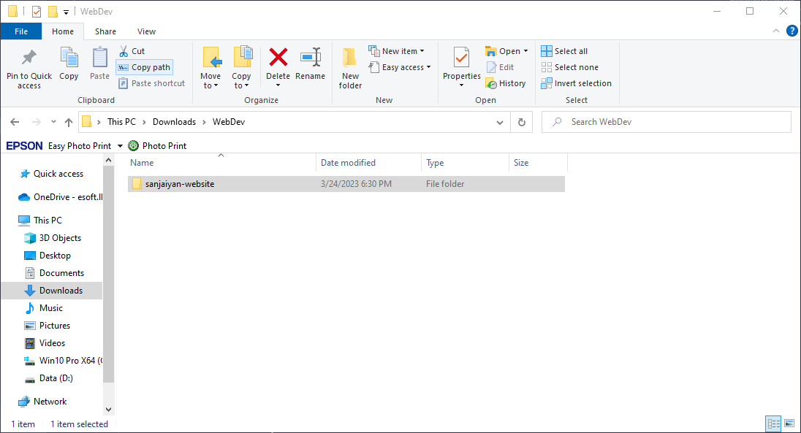
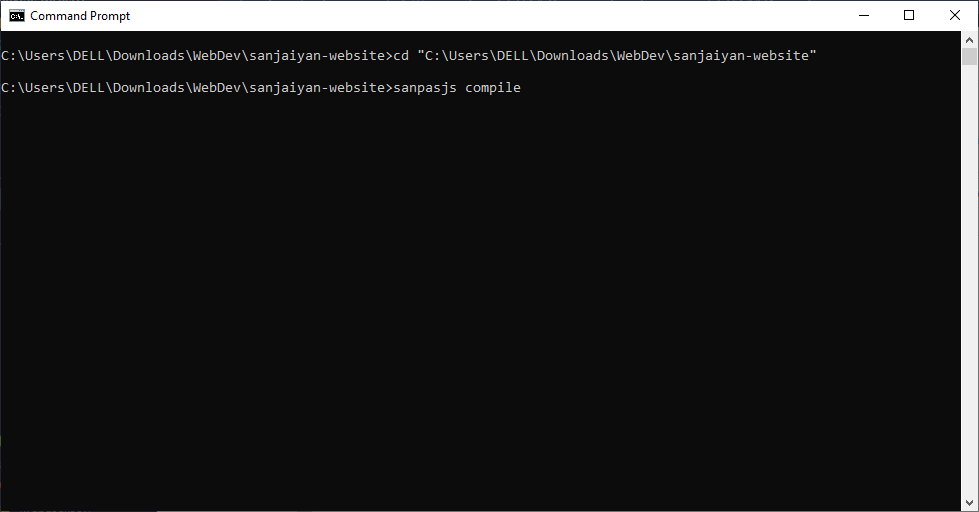

# The `compile` sub-command

Compile your Pascal program to Javascript code which can be executed in the web browsers.

## Arguments

|  Name  |  Type  |  Default Value  |                        Description                        |
| :----: | :----: | :-------------: | :-------------------------------------------------------: |
| input  | string | ./sanpasjs.pas  |          Pascal file path needed to be compiled           |
| output | string | ./dist/index.js | Javascript file path where compiled file should be placed |

## Sample

```shell
sanpasjs new --input <PASCAL_INPUT_FILE_PATH> --output <JS_OUTPUT_FILE_PATH>
```

## Description

The follwing code will help to transpile your Pascal program to Javascript program.
Currently, this command configured for ease use of [`sanpasjs new`](/guides/commands/new.md) command.
For example if you created the project using [`sanpasjs new`](/guides/commands/new.md) command you just need to run (no need to specify other options)

```shell
sanpasjs compile
```

Before running the above code you need to make sure correct folder.



If you are not using [`sanpasjs new`](/guides/commands/new.md) command, you need to specific file paths to run the command [as shown in the sample](#sample).

## Example

```shell
sanpasjs new --input input_pascal_file.pas --output output_js_file.js
```

<style>
    * {
        scroll-behavior: smooth;
    }
</style>
