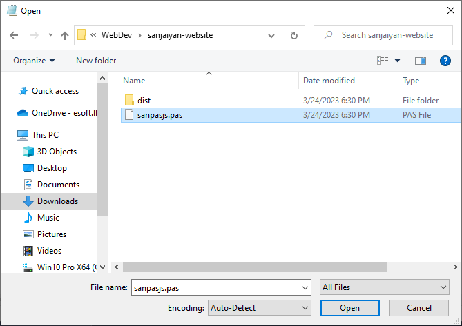

# The `new` sub-command

Create a new project folder with relevant files for a quick start.

## Arguments

| Name |  Type  | Default Value |    Description    |
| :--: | :----: | :-----------: | :---------------: |
| name | string |       -       | Your project name |

## Sample

```shell
sanpasjs new --name <PROJECT_NAME>
```

## Description

By running the above shell command you can create a new project folder.

- Copy the root path you need to create your project.
  
- Then paste it in your shell as format shown below.
  <br/>
  <small>(No need of `<` `>`)</small>
  ```shell
   cd <FILE_PATH_YOU_COPIED>
  ```
  
- Then click `Enter` to change the directory.
- Afterwards, run [`sanpasjs new`](#sample) command to create the project folder with `name` option.
- Open the `sanpasjs.pas` file in your favourite text editor to edit the pascal file.
- Here, I am using notepad but you can use any text editor you like to use :smile:
  <br />
  <small>
  If you are using `notepad` like shown below, please select file type to `All Files` to view the pascal file.
  </small>
  
  
- To transpile your code run [`sanpasjs compile`](/guides/commands/compile#description) subcommand.
- To view your website in web browser. Go to the project folder you created and click the HTML file which will be located in `<YOUR_PRJ_PATH>/dist/index.html`.
  
   

## Project Structure
Project structure when using [`sanpasjs new`](#description) command.

```
|- sanpasjs.pas
|- dist
    |- index.html
    |- index.js
```

## Example

```shell
sanpasjs new --name sanjaiyan-website
```

<style>
    * {
        scroll-behavior: smooth;
    }
</style>
