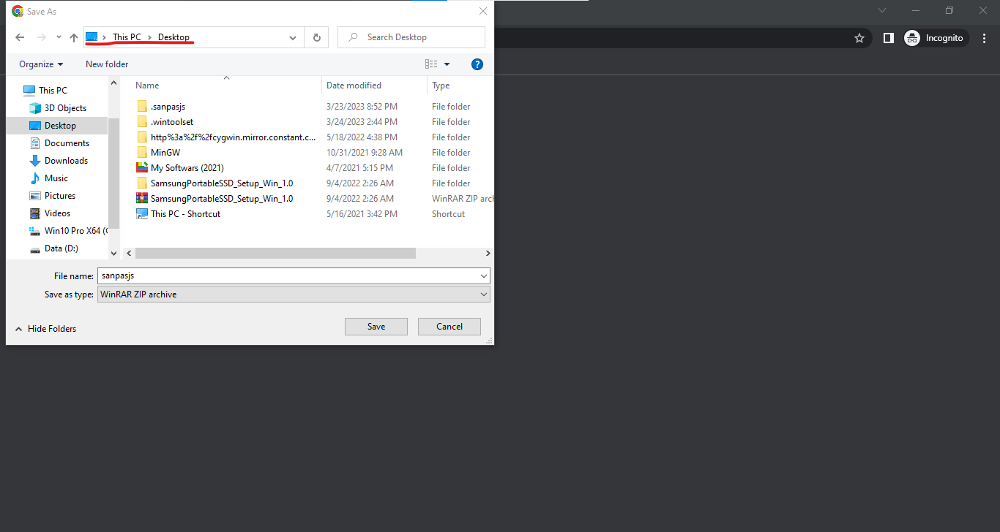
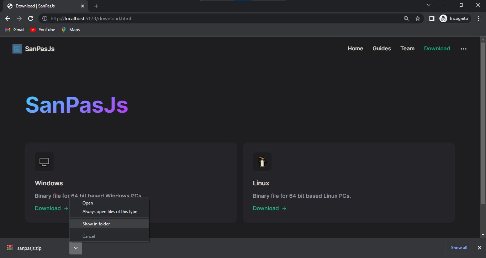

[[toc]]

## Steps to up and run the _SanPasJs_

### 1) Installing Binary File

- Please navigate to the [download page](/download.html).
  <br/>
  <small>Make sure your system support 64-bit architecture.</small>
- And select the relevant binary file to download.
- Make sure you select the `Desktop` folder in your drive. (optional but recommended)
  <br/>
  <small>If you are unable to download it in the specified directory (`Desktop`).
  Please make sure you note the root directory you have selected to continue the workflow easily.</small>



### 2) Opening the `.zip` file in file explorer

- Click the arrow pointer to open the popup.
- Then click `show in folder`.



### 3) Double click the `.zip` file to extract

- Double click the file named `sanpasjs.zip` (File name you used when [downloading the binary](#_1-installing-binary-file)).


### 4) Extracting the `.zip` file

- After completing the [third step](#_3-double-click-the-zip-file-to-extract) which prompts a new window.
- Click `Extract To` (Make sure you extract it as a folder, **not** as a single binary file).


:::details Solving `WinRar` purchase alert

- If you encounter the following error prompt which requests to purchase the `WinRar` just click the close button. It won't affect our workflow.
  
  :::

### 5) Confirming the destination of unzipped folder

- After [clicking the `Extract To` button](#_4-extracting-the-zip-file) which prompts another window to choose the destination of the folder.
- Please make sure you select the same destination (root directory) where we downloaded the `.zip` from [step 01](#_1-installing-binary-file).
  <br/>
  <small>As per recommendation, we selected `Desktop` folder in [step 01](#_1-installing-binary-file).</small>

  - Please make sure to extract it to the `Desktop` folder. Better to remove `sanpasjs` from the directory path if shown.
    :::details Correcting destination folder
    Make sure the last path of the destination is _similar_ to the below one (the last location point should be the same as higlighted part).
    
    :::

- Then click `OK` to extract it.


### 6) Make the command available globally

By following these steps you can make `sanpasjs` command available globally on your PC.

- Click the search bar on your PC.
- And type `edit the system environment variables` in it.


### 7) Editing System Variables

- After [the search, click the open button](#_6-make-the-command-availabele-globally) which prompts a new window similar to that shown below.
- Make sure you are under the `Advanced` setting option then click the button `Environment Varibales` shown at the bottom of the window.


### 8) Adding New Env Variable

After following [the above step](#_7-editing-system-variables) you should be prompted with a new window to edit your environmental variables.

- Click the `Path` option under **System Variables**. (As shown below)
- Then, click `Edit` button under the **System Variables** section.


### 9) Selecting a file to add to the system variable

After following [the above step](#_8-adding-new-env-variable) you should be prompted with new window to select your environmental variables paths.

- Click `Browse` button to add new _System Variables_.


### 10) Finalizing the _System Variable_

- After [clicking `Browse` button as stated above](#_9-selecting-file-to-add-into-system-variable) which prompts a small window to select the destination of where folder located.
- Make sure you click the [folder where you unziped the file](#_5-confirming-the-destination-of-unzipped-folder).
- Click the folder which created when unzipping (mostly named `sanpasjs`)
- After choosing the correct path click `Ok` on all the windows (including previous windows)


### 11) Celebration Time :tada:

You have now successfully installed the `SanPasJs`. You can access it from any shell application (Powershell, Command Prompt, Bash...).

- To check it open `Command Prompt`.
- Then run the following command in it.

:::tip
If it failed to run the command, please try to restart your system.
:::

```shell
sanpasjs --help
```


---

<small>Above walkthrough can be followed in all types of _Windows OS_, including **Windows 8**, **Windows 10** and **Windows 11**.</small>

<style>
    * {
        scroll-behavior: smooth;
    }
</style>
